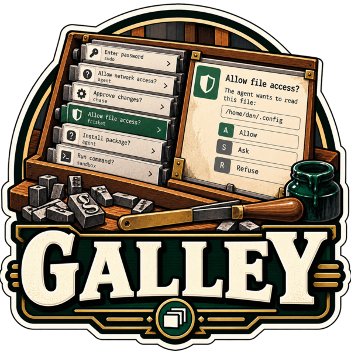

<p align="center"></p>

# galley

A zenity drop-in whose dialogs stack. Each call puts its question in one
shared window instead of opening a modal of its own: the waiting questions on
the left, the selected one on the right, and the keys to answer it. The
command line, the exit codes and what is printed are zenity's, so anything
that calls zenity can call galley instead, unchanged.

> A *galley* is the tray where set type stacks up, line after line, waiting
> to be proofed. Like [flong](https://github.com/danielbodart/flong) and
> [frisket](https://github.com/danielbodart/frisket), it is a printing word.

Written for the questions an agent sandbox asks a person -- frisket's
Allow / Ask / Refuse for a request, sudo's password, chase's approval of a
changed grant -- which arrive in bursts, from several sessions at once, and
used to arrive as a pile of windows each taking the keyboard from whatever
was being typed.

## Example

With home-manager:

```nix
{
  imports = [ inputs.galley.homeModules.default ];
  services.galley.enable = true;
}
```

Then, anywhere zenity was called:

```console
$ galley --question --title="Allow this request?" --no-markup \
    --ok-label=Allow --cancel-label=Refuse --extra-button=Ask \
    --text="POST api.github.com/repos/x/issues"
Ask
$ echo $?
1
```

- **sudo's graphical askpass.** `SUDO_ASKPASS` names a script that runs
  `galley --entry --hide-text --title=… --text=…` and passes its stdout on;
  the password reaches sudo and nothing else.
- **frisket's asker.** Its `--question` with `--ok-label=Allow
  --cancel-label=Refuse --extra-button=Ask` exits 0, 1, or 1 with `Ask` on
  stdout, exactly as under zenity.
- **chase's approver.** `--text-info --filename=… --ok-label=Approve
  --cancel-label=Refuse` exits 0 to approve.

galley is installed only as `galley`, never under zenity's name: a caller
is pointed at it, `lib.getExe galley` where it named `lib.getExe pkgs.zenity`,
and its command line stays as it was.

## The window

It never takes focus on its own. A question arriving adds a row and, when
the window is not the one in front, a notification says something is
waiting; the window is not raised for it. A dialog that appears under the
cursor is answered by whatever key was on its way -- the Enter that ends a
command in a terminal -- and these questions exist for the presses that are
meant. The notification is urgent, so GNOME shows it under Do Not Disturb
too and keeps it until it is dismissed or the window comes forward; it is
the only cue, as there is no tray count. Bring it forward with the
notification, or with `galley --show` on a
keyboard shortcut (GNOME: *Settings → Keyboard → Custom Shortcuts*). Under
Wayland a window may only take focus with an activation token; `--show` passes
on the one it was started with (`XDG_ACTIVATION_TOKEN`), and without one GNOME
may say the window is ready rather than raise it.

| key | |
|---|---|
| `j` / `k`, `↓` / `↑` | move through the queue |
| `Enter` | the default button: OK, Yes or Allow, or Cancel with `--default-cancel`; or the focused button, once `Tab` has reached one |
| a button's letter | that button: the label's mnemonic (`_Allow` is `a`), else its first letter no other button has; underlined on the button |
| `Alt` + letter | the same, while typing in a field |
| `Page Up` / `Page Down` | scroll the selected question |
| `Escape` | hide the window; nothing is answered |

Keys answer at once: there is no delay before they count and no second
confirmation. What is selected is what they act on, so only you move the
selection. Nothing arriving moves it, and nothing going does either: when
the selected question is withdrawn -- its asker killed, timed out or tired of
waiting -- nothing is selected until you pick again with `j`, `k`, an arrow
or a click (`↓` is the question that took its place), so an Enter or the
rest of a password on its way lands nowhere rather than on the question
beside it. A key held down answers one question, not one per repeat. `j` and
`k` are never a button's.

Questions are grouped by `--title` -- frisket's are all "Allow this
request?", sudo's "Authentication Required" -- newest at the bottom, each
showing how long it has waited. A client that is killed, or whose caller
stops waiting, takes its question with it.

It looks as the desktop does: libadwaita's dark or light style, GNOME's
accent colour and high contrast, followed as they change while the window is
open. They reach it as they reach any libadwaita application, through the
settings portal on the session bus, which the units leave as the session
set it; galley forces no colour scheme and draws no colours of its own.

## Compatibility

| | |
|---|---|
| **Dialogs** | `--question` (with `--switch`; with no `--extra-button` it gets a Close button, which exits as zenity's Escape does), `--info`, `--warning`, `--error`, `--entry`, `--text-info` |
| **Options** | `--title`, `--text`, `--ok-label`, `--cancel-label`, `--extra-button` (repeatable), `--timeout`, `--width`, `--height`, `--icon`, `--no-markup`, `--no-wrap`, `--ellipsize`, `--default-cancel`, `--entry-text`, `--hide-text`, `--filename` (else stdin, read as it arrives), `--checkbox`, `--auto-scroll` |
| **Exits** | 0 OK, 1 Cancel, 1 and the label on stdout for an extra button, 5 timed out, 255 a command-line error; `ZENITY_OK` / `DIALOG_OK` and the rest override each, as in zenity |
| **Text** | As zenity 4.2 treats it: a message's `--text` has GLib's escapes undone (`\n`, `\t`, octal) and is markup, unless `--no-markup`, when it is taken as it is; an entry's `--text` has its escapes undone and is a mnemonic label (`__` is `_`); an entry's text is printed on OK and on timeout |
| **Fitted** | what zenity takes and the window holds less of: a `--width` or `--height` beyond -1 to 100000 is that end of it; a `--title` or `--checkbox` over 1024 characters, or a button's label over 256, is cut short with an ellipsis (an extra button still prints its label whole) |
| **Accepted, ignored** | every other zenity option, with any dialog, as zenity accepts them -- `--modal`, `--attach`, `--window-icon`, `--font`, … -- except where zenity itself refuses one for a dialog |
| **Refused** | the dialogs that do not stack (`--list`, `--forms`, `--progress`, `--file-selection`, `--calendar`, …), `--editable`, `--html`, `--url`, an `--entry` given a list of values, and more than 16 buttons; each says so and exits 255 |
| **No window** | when the window cannot be reached, galley exits 1 having said why, as zenity does when GTK has no display |

galley reads zenity 4.2.2's command line; `galley --version` prints
galley's own version.

## How it works

`galley` is a thin client, a static Go binary that starts in about a
millisecond. It reads the command line, connects to
`$XDG_RUNTIME_DIR/galley/sock`, sends the question as one line of JSON, and
blocks until the answer comes back on the same connection. The connection is
the question: when the client exits, the kernel closes it and the window
drops the row.

The window is one long-running GJS process, GTK 4 and libadwaita, started by
systemd the first time something connects (a socket-activated user service;
the units are in the home-manager module, and in the package under
`share/systemd/user`). The first question takes about 90 ms while it
starts (measured on GTK's broadway backend); after that a round trip is
about 3 ms. It can also be run by hand, `galley-daemon`, when it binds the
socket itself.

Everything the window renders arrives in its final form: zenity's escapes
and mnemonics are undone in the client, where they are tested, and the
window only draws.

## Security

- **The socket is private.** It lives in `$XDG_RUNTIME_DIR/galley/`, a 0700
  directory. The client refuses a directory anyone else can open and a window
  running as anyone else (`SO_PEERCRED`), and the window checks its peers the
  same way: a password goes down this socket.
- **Answers are not on D-Bus.** galley is a GApplication, and a
  GApplication's actions are exported on the session bus, so buttons answer
  through their own signal handlers and no action answers anything. The one
  action is `show`. GTK's accessibility bus could press a button too, so
  the units start the window with it off (`GTK_A11Y=none`) unless
  `services.galley.accessibility` is set; a window started by hand has it
  on.
- **Caller text is text.** Titles, bodies, labels and files are set as plain
  text. Where zenity reads `--text` as markup, galley parses it with Pango
  and keeps only emphasis -- bold, italic, underline, strikethrough,
  monospace; colours, sizes, fonts and links never reach the screen, so a
  question cannot hide part of itself. Markup that does not parse is shown as
  written.
- **A password is not kept.** A hidden entry's text goes from the field to
  the client's stdout and nowhere else: never logged, never written to disk,
  and cleared from the field the moment it is answered or withdrawn.
- **A sandbox cannot ask.** A session sandboxed without
  `$XDG_RUNTIME_DIR` -- flong's, a container's -- cannot reach the socket,
  and that is the design: questions come from the host's own programs, such
  as frisket and sudo, about what a sandbox does. Give a sandbox the socket
  and it can put any question it likes in front of you.
- **Everything else in the session can.** Any process running as you can
  connect, as it could run zenity. And GTK's accessibility bus, where it is
  on, lets such a process press buttons in any window; galley's is off it
  unless asked for, the rest of the desktop's is the desktop's boundary.
- **The test control is not shipped.** The end-to-end check presses keys
  through `daemon/test-control.js`; the package leaves that file out.

## Options

| option | default | |
|---|---|---|
| `services.galley.enable` | `false` | The socket, and the window it starts. |
| `services.galley.package` | this flake's `galley` | The client and the window. |
| `services.galley.accessibility` | `false` | Leave GTK's accessibility bus on for the window, as a screen reader needs. |

Package: `galley` (`bin/galley`, `bin/galley-daemon`). `$GALLEY_SOCKET`
overrides the socket's path for the client and the window, for tests. It does not make a second window: the window is
one application on the session bus, and a second `galley-daemon` in the
same session says so and exits 1 rather than leave its socket unserved.

## Development

```console
$ nix develop          # go, gjs, gtk4, libadwaita
$ go test ./...
$ gjs -m tests/units.js
$ gjs -m tests/appearance.js   # the window following the desktop's style
$ GALLEY_E2E_DAEMON="gjs -m $PWD/daemon/main.js" \
  GALLEY_E2E_BROADWAYD=$(command -v gtk4-broadwayd) go test -v ./tests/
$ nix flake check      # build, client tests, vet, gofmt, the window's units,
                       # the end-to-end test on GTK's broadway backend, the
                       # appearance test, and
                       # the home-manager module's units
```

The end-to-end and appearance tests run the real window on broadway, which
needs no display, and never touch the desktop they run on: they drop
`WAYLAND_DISPLAY`, `DISPLAY` and the session bus first. The appearance test
runs its own session bus, with a stand-in for the settings portal, and keeps
its GSettings in a keyfile of its own. The end-to-end test's keys reach the
window's own handler through the test control; what GTK does with a key the
window leaves -- Enter on a focused button, a character in a field -- the
control imitates rather than tests, since GTK 4 has no way to synthesise a
key event.

## Licence

MIT.
