<p align="center"></p>

# galley

A zenity drop-in whose dialogs stack. Each call puts its question in one
shared window instead of opening a modal of its own: the waiting questions on
the left, the selected one on the right, and the keys to answer it. The
command line, the exit codes and what is printed are zenity's, so anything
that calls zenity can call galley instead, unchanged.

> A *galley* is the tray where set type stacks up, line after line, waiting
> to be proofed. Like [flong](https://github.com/danielbodart/flong) and
> [frisket](https://github.com/danielbodart/frisket), it is a printing word.

Written for the questions an agent sandbox asks a person -- frisket's
Allow / Ask / Refuse for a request, sudo's password, chase's approval of a
changed grant -- which arrive in bursts, from several sessions at once, and
used to arrive as a pile of windows each taking the keyboard from whatever
was being typed.

<p align="center">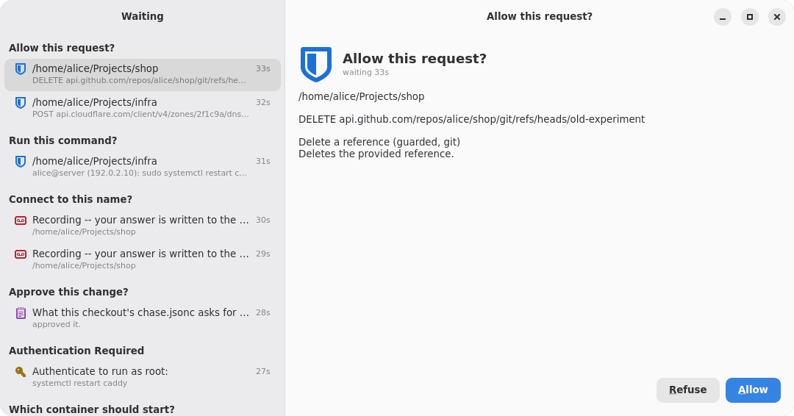</p>

## What it looks like

The window as `examples/stack.sh` fills it: the questions galley's own
callers ask -- frisket's asker for two requests, an SSH command and two
connections it is recording, chase's approver with a changed grant, and
sudo's askpass -- and below them one of each of zenity's other dialogs, out
of sight further down the queue. Each is a row on the left, under its
`--title`, with its icon and how long it has waited; the selected one is the
page on the right.

| | |
|:---:|:---:|
| 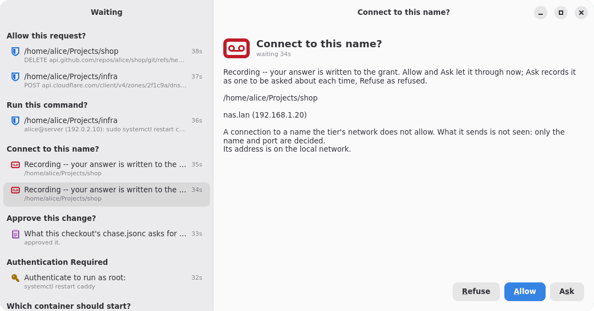<br>frisket's asker, recording: `--question --extra-button=Ask --icon=media-tape` | 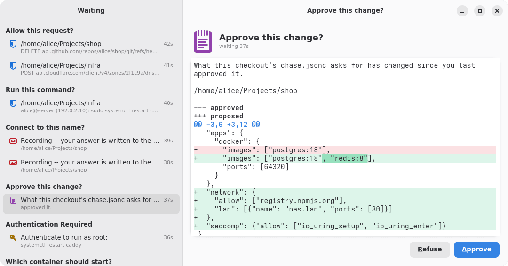<br>chase's approver: `--text-info` holding a unified diff |
| 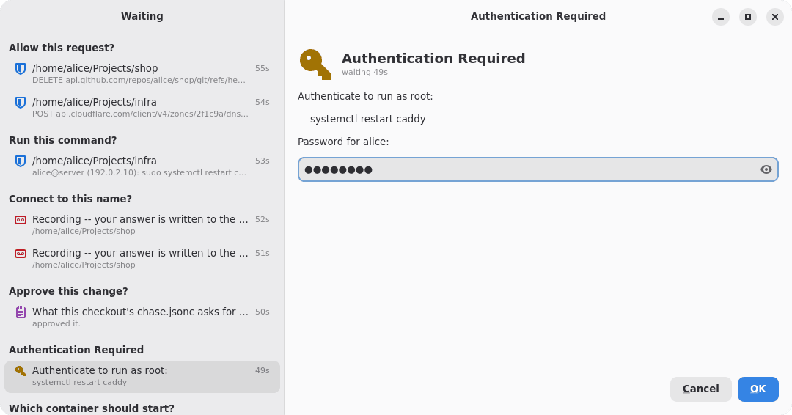<br>sudo's askpass: `--entry --hide-text` | 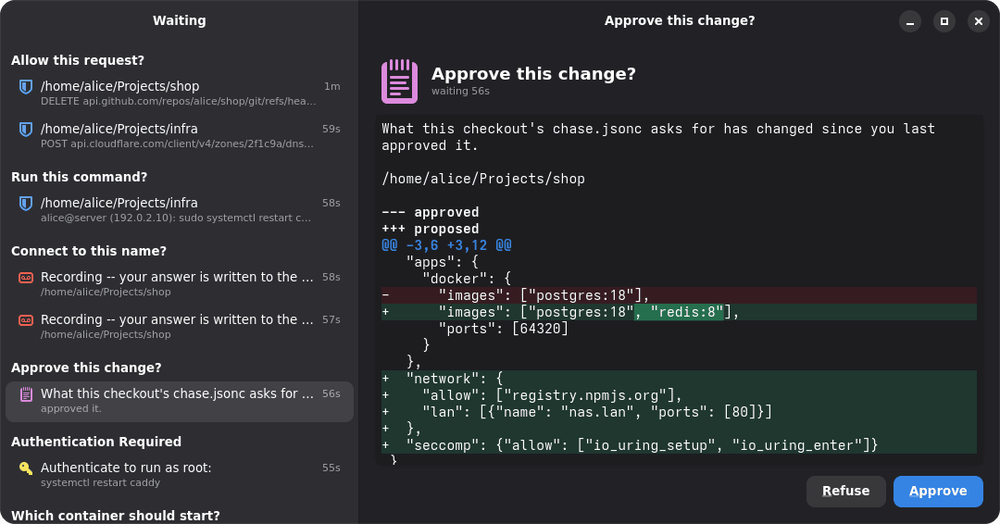<br>the same, in the dark style |

<p align="center">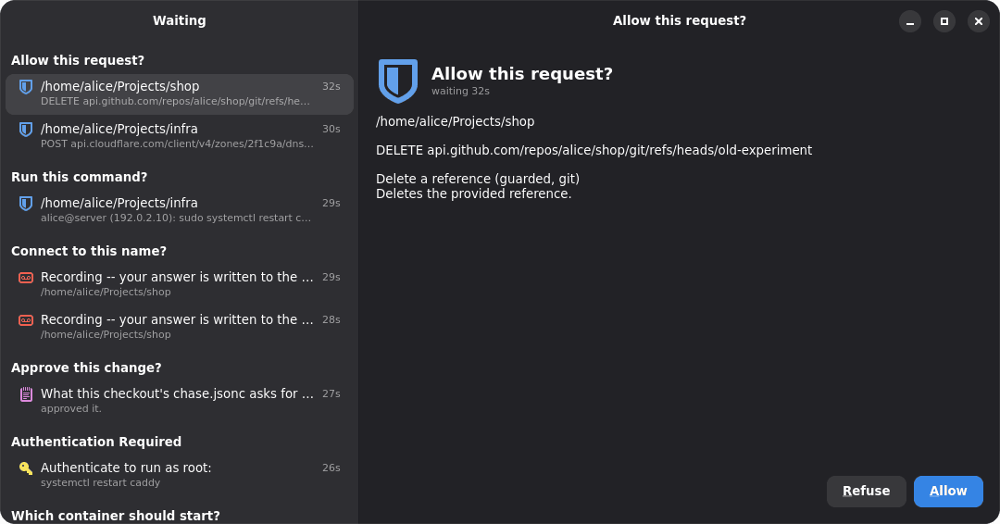<br>The desktop's dark style, followed as it changes.</p>

One of each of the other dialogs, as the page on the right shows it:

| | | |
|:---:|:---:|:---:|
| 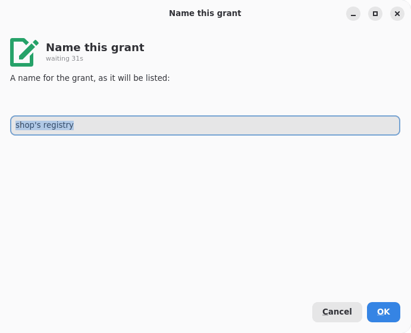<br>`--entry` | 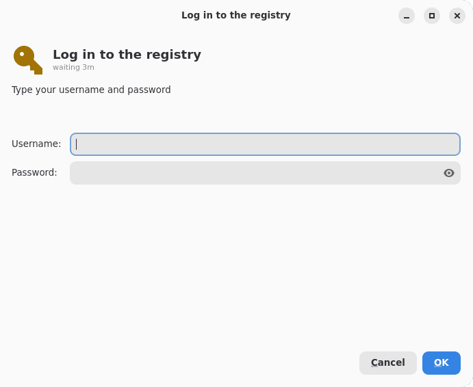<br>`--password --username` | 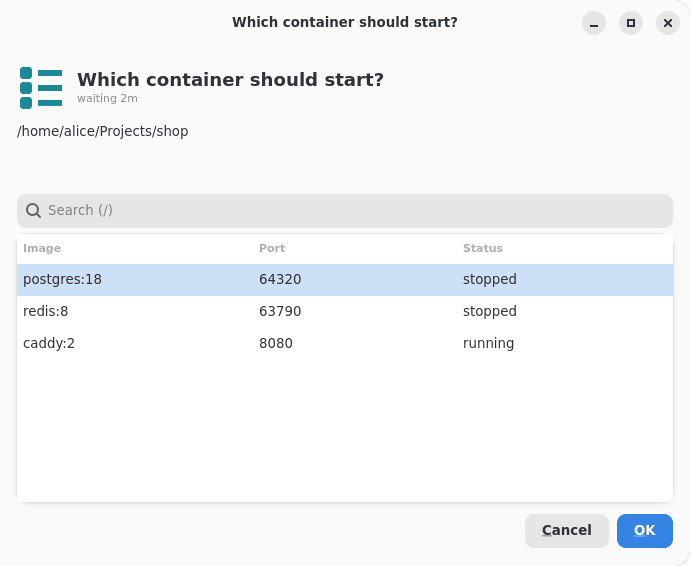<br>`--list` |
| 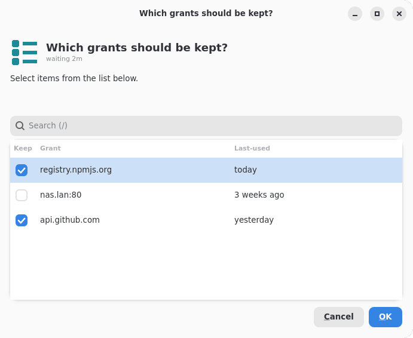<br>`--list --checklist` | 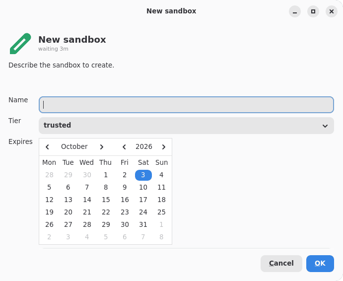<br>`--forms` | 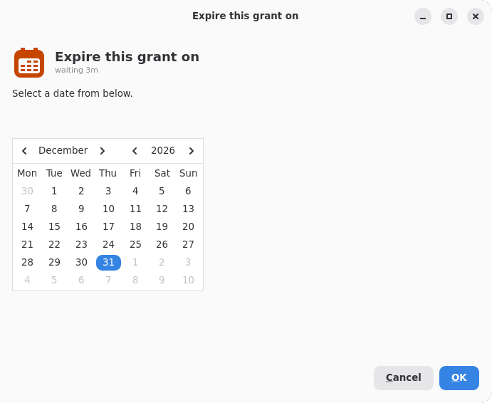<br>`--calendar` |
| 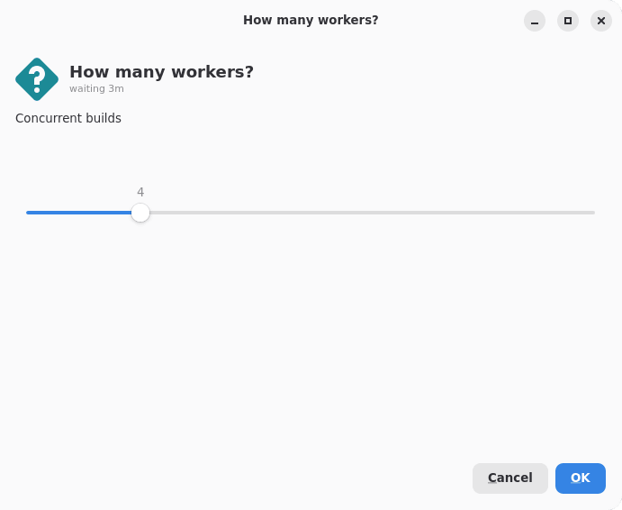<br>`--scale` | 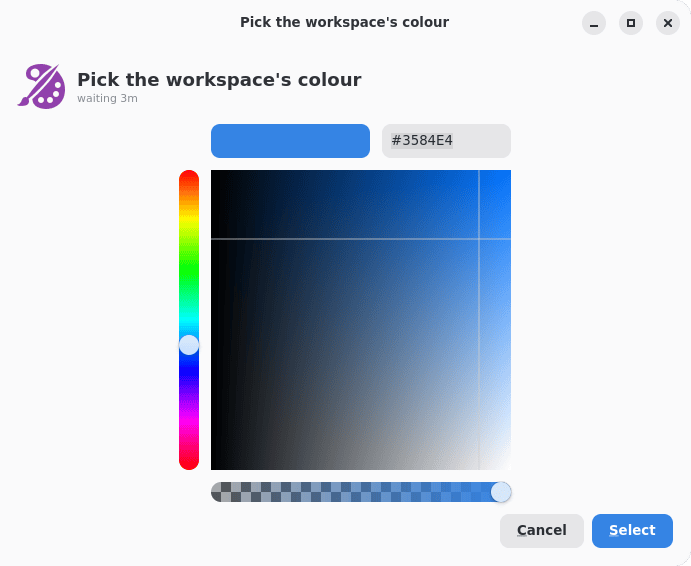<br>`--color-selection` | 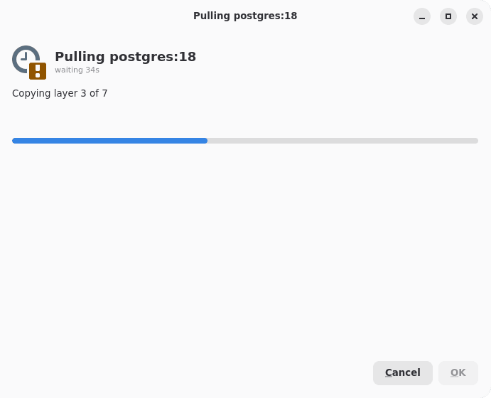<br>`--progress` |
| 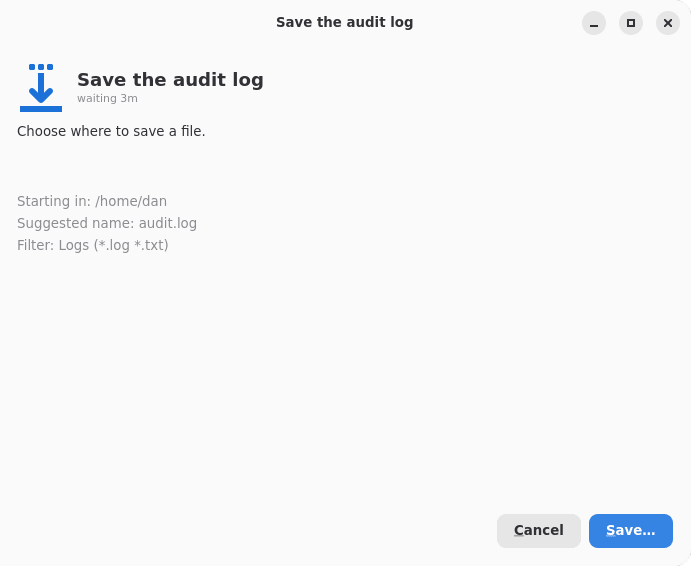<br>`--file-selection --save` | 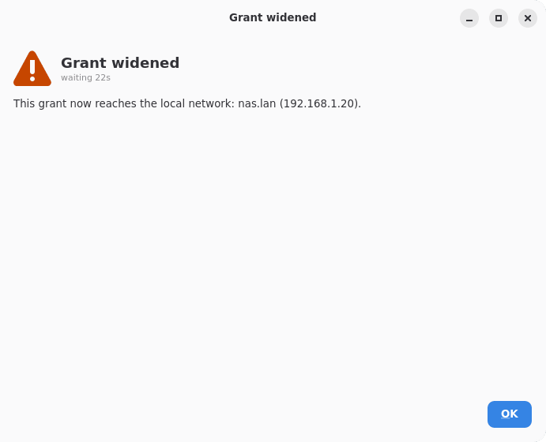<br>`--warning` | 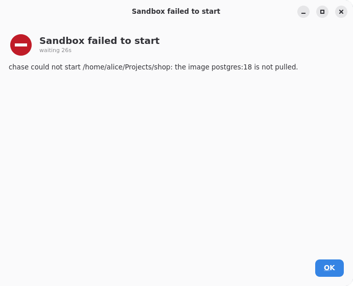<br>`--error` |

A file chooser's page says what it asks for, and its button opens GTK's own
chooser; `--info` is laid out as `--warning` is, under an icon of its own.

## Example

With home-manager:

```nix
{
  imports = [ inputs.galley.homeModules.default ];
  services.galley.enable = true;
}
```

Then, anywhere zenity was called:

```console
$ galley --question --title="Allow this request?" --no-markup \
    --ok-label=Allow --cancel-label=Refuse --extra-button=Ask \
    --text="POST api.github.com/repos/x/issues"
Ask
$ echo $?
1
```

- **sudo's graphical askpass.** `SUDO_ASKPASS` names a script that runs
  `galley --entry --hide-text --title=… --text=…` and passes its stdout on;
  the password reaches sudo and nothing else.
- **frisket's asker.** Its `--question` with `--ok-label=Allow
  --cancel-label=Refuse --extra-button=Ask` exits 0, 1, or 1 with `Ask` on
  stdout, exactly as under zenity.
- **chase's approver.** `--text-info --filename=… --ok-label=Approve
  --cancel-label=Refuse` exits 0 to approve. Its text holds a unified
  diff, which galley colours as one -- any `--text-info` that is not
  `--editable` does, when it holds `---`, `+++` and `@@` headers one after
  another -- with nothing asked of the caller, and nothing changed in the
  text or what is printed.

galley is installed only as `galley`, never under zenity's name: a caller
is pointed at it, `lib.getExe galley` where it named `lib.getExe pkgs.zenity`,
and its command line stays as it was.

## The window

It never takes focus on its own. A question arriving adds a row and, when
the window is not the one in front, a notification says something is
waiting; the window is not raised for it. (A progress bar says nothing, and a
notification says itself; see below.) A dialog that appears under the
cursor is answered by whatever key was on its way -- the Enter that ends a
command in a terminal -- and these questions exist for the presses that are
meant. The notification is urgent, so GNOME shows it under Do Not Disturb
too and keeps it until it is dismissed or the window comes forward; it is
the only cue, as there is no tray count. Bring it forward with the
notification, or with `galley --show` on a
keyboard shortcut (GNOME: *Settings → Keyboard → Custom Shortcuts*). Under
Wayland a window may only take focus with an activation token; `--show` passes
on the one it was started with (`XDG_ACTIVATION_TOKEN`), and without one GNOME
may say the window is ready rather than raise it.

| key | |
|---|---|
| `j` / `k`, `↓` / `↑` | move through the queue |
| `Alt` + `↓` / `↑` | the same, from a list, a calendar or a scale, which have the arrows while they have the focus |
| `Enter` | the default button: OK, Yes or Allow, or Cancel with `--default-cancel`; or the focused button, once `Tab` has reached one; a new line in a field of several lines; the end of an edit in a list's cell |
| a button's letter | that button: the label's mnemonic (`_Allow` is `a`), else its first letter no other button has; underlined on the button |
| `Alt` + letter | the same, while typing in a field |
| `Space` | tick or untick the selected row of a `--checklist`, or choose it in a `--radiolist` |
| `/` | the search of the selected list |
| `Page Up` / `Page Down` | scroll the selected question |
| `Escape` | hide the window; nothing is answered |

Keys answer at once: there is no delay before they count and no second
confirmation. What is selected is what they act on, so only you move the
selection. Nothing arriving moves it, and nothing going does either: when
the selected question is withdrawn -- its asker killed, timed out or tired of
waiting -- nothing is selected until you pick again with `j`, `k`, an arrow
or a click (`↓` is the question that took its place), so an Enter or the
rest of a password on its way lands nowhere rather than on the question
beside it. A key held down answers one question, not one per repeat. `j` and
`k` are never a button's.

What is selected takes the focus that suits it: an entry, a password or a
form's first field to be typed into, a list, a calendar or a scale to move
through with the arrows; anything else leaves it on the queue, where letters
are the buttons'. A row of a list is chosen with a click, a double click
answers OK, and a click ticks a check or radio list's row.

Questions are grouped by `--title` -- frisket's are all "Allow this
request?", sudo's "Authentication Required" -- newest at the bottom, each
showing how long it has waited. A client that is killed, or whose caller
stops waiting, takes its question with it.

Every one of zenity's dialogs is an item in the queue, the ones that ask
nothing too, so that whatever arrives is worked through in the order it came:

- **A progress bar** is a live item, fed from its stdin as zenity reads it --
  a number sets the percentage, a `#` line the text, `pulsate:true` or
  `pulsate:false` the bar's moving on its own -- with its bar in its row too.
  Its OK is there to press once it reaches 100% or its stdin ends; with
  `--auto-close` it goes by itself, and with `--auto-kill` its Cancel hangs
  up on its caller (SIGHUP), as zenity's does.
- **A file chooser** is an item saying what it asks for -- a file to open,
  where to save, a folder; one or several; where it starts and with which
  filters -- whose button opens GTK's own file chooser (`Gtk.FileDialog`,
  through the desktop's portal on GNOME). What is chosen there answers it; a
  chooser closed without choosing leaves it waiting.
- **A notification** is an entry with its text and icon, there until you
  dismiss it with its button. `galley --notification` returns at once, as
  zenity does, and the entry outlives it; with `--listen` it reads zenity's
  commands from stdin -- `message:` and `tooltip:` set the entry's text, a new
  entry once the last is dismissed, `icon:` the icon of what follows,
  `visible:` nothing, as in zenity 4.2 -- and returns when stdin ends. When
  the window is not in front, a notification also goes to the desktop, with
  its own text, at normal priority, and is withdrawn when the entry is
  dismissed or the window comes forward.

It looks as the desktop does: libadwaita's dark or light style, GNOME's
accent colour and high contrast, followed as they change while the window is
open. They reach it as they reach any libadwaita application, through the
settings portal on the session bus, which the units leave as the session
set it; galley forces no colour scheme. Its one colour of its own is each
question's icon: the same icon in the queue and over the question, its
symbolic form tinted from libadwaita's palette by the icon's name, a shade
for the dark style and one for the light, so `--icon` tells kinds of
question apart at a glance. Every password prompt shows a key: `--password`,
`--entry --hide-text`, a `--forms` with an `--add-password`.

## Compatibility

All of zenity 4.2.2's command line but `--html` and `--url`, as zenity reads
it: GOption's syntax, `--GROUP-OPTION` for an option of a group (zenity's own
way to `--forms-date-format`), the same checks after parsing in the same
order, the same warnings and the same words for each mistake -- compared
with zenity's own over thousands of command lines.

| | |
|---|---|
| **Dialogs** | `--question` (with `--switch`), `--info`, `--warning`, `--error`, `--entry` (a combo when given values after its options), `--password`, `--text-info` (with `--editable`), `--list` (`--checklist`, `--radiolist`, `--imagelist`), `--forms`, `--calendar`, `--scale`, `--color-selection`, `--file-selection`, `--progress`, `--notification` (with `--listen`), `--about` |
| **Options** | every one each dialog takes in zenity: `--title`, `--text`, `--ok-label`, `--cancel-label`, `--extra-button`, `--timeout`, `--width`, `--height`, `--icon` (and its deprecated `--window-icon` and `--icon-name`, with zenity's warnings), `--no-markup`, `--no-wrap`, `--ellipsize`, `--default-cancel`, `--entry-text`, `--hide-text`, `--filename` (else stdin, read as it arrives), `--checkbox`, `--auto-scroll`, `--username`; a list's `--column`, `--separator`, `--multiple`, `--editable`, `--print-column`, `--hide-column`, `--hide-header` and rows after the options or on stdin; a form's `--add-entry`, `--add-password`, `--add-multiline-entry`, `--add-calendar`, `--add-list`, `--list-values`, `--column-values`, `--show-header`, `--add-combo`, `--combo-values`, `--forms-date-format`; `--day`, `--month`, `--year`, `--date-format`; `--value`, `--min-value`, `--max-value`, `--step`, `--print-partial`, `--hide-value`; `--color`, `--show-palette`; `--save`, `--directory`, `--file-filter`; `--percentage`, `--pulsate`, `--auto-close`, `--auto-kill`, `--no-cancel`, `--time-remaining` |
| **Output** | zenity's, dialog by dialog: a list's printed columns joined by the separator (its escapes undone), nothing when nothing is chosen; a form's fields joined by its separator, a list's cells each with a comma unless it is last; a date by `--date-format` (GLib's), else the locale's `%x`, in the caller's `LC_TIME`; a scale's value, and each as it moves with `--print-partial`; `user\|password`; `rgb(…)` or `rgba(…)`; the chosen paths joined by the separator; an editable text as it ends, with no newline added. On a timeout, what zenity prints then: an entry's, a list's, a form's, a calendar's, a scale's and an editable text's values; nothing for the rest |
| **Exits** | 0 OK, 1 Cancel, 1 and the label on stdout for an extra button, 5 timed out, 255 a command-line error; `ZENITY_OK` / `DIALOG_OK` and the rest override each, as in zenity. What zenity refuses once its dialog has started is said as it says it and exits as it does: 0 for a list with no `--column`, a check or radio list with fewer than two, two list types, or a scale out of its range (zenity sets an error code and never reads it); 255 for `--auto-close --percentage=100`; 1 for a `--notification` with no text |
| **Text** | As zenity 4.2 treats it: a message's `--text` has GLib's escapes undone (`\n`, `\t`, octal) and is markup, unless `--no-markup`, when it is taken as it is; a list's, a form's, a calendar's, a scale's and a progress bar's `--text` and `#` lines likewise, always as markup; an entry's `--text` has its escapes undone and is a mnemonic label (`__` is `_`); a notification's has its escapes undone and is plain, its first line the title; cells, labels and paths are plain |
| **Fitted** | what zenity takes and the window holds less of: a `--width` or `--height` beyond -1 to 100000 is that end of it; a `--title` or `--checkbox` over 1024 characters, or a button's label over 256, is cut short with an ellipsis (an extra button still prints its label whole); a list holds at most 100000 rows |
| **Refused** | `--html` and `--url`, which need WebKit, by name, and more than 16 buttons; each says so and exits 255 |
| **No window** | when the window cannot be reached, galley exits 1 having said why, as zenity does when GTK has no display |

galley reads zenity 4.2.2's command line; `galley --version` prints
galley's own version, and `--about` is galley's.

Where galley does otherwise, it is on purpose:

- **A notification outlives its client**, as zenity's does in the desktop's
  tray, and so is not withdrawn when its client is killed: it is the
  person's to dismiss. `--notification --listen` returns when its stdin
  ends, where zenity listens on, holding nothing, until it is killed.
- **A progress bar, a file chooser and a notification are items**, so their
  windows are galley's: the file chooser opens only when you ask for it,
  rather than under the cursor, and the colour chooser is the same widget as
  zenity's in the item's page.
- **`--font` is ignored**, as it was before: a text in a size of the
  caller's choosing could be made unreadable.
- **A form's lists each take the `--column-values` of their own place**, or
  the first. zenity reads the second list's from `--list-values` by mistake,
  and crashes when there are none.
- **A `--radiolist` with more than one TRUE** starts on the last of them, as
  GTK's group makes it for the rows zenity draws at the start; the rows it
  has not drawn are left unticked there whatever they say.
- **Dates use the window's GLib**, switched to the caller's `LC_TIME` for
  the moment of writing one when the window's system has that locale; the
  calendar's own month and day names are the window's.

## How it works

`galley` is a thin client, a static Go binary that starts in about a
millisecond. It reads the command line, connects to
`$XDG_RUNTIME_DIR/galley/sock`, sends the question as one line of JSON, and
blocks until the answer comes back on the same connection. The connection is
the question: when the client exits, the kernel closes it and the window
drops the row.

The window is one long-running GJS process, GTK 4 and libadwaita, started by
systemd the first time something connects (a socket-activated user service;
the units are in the home-manager module, and in the package under
`share/systemd/user`). The first question takes about 90 ms while it
starts (measured on GTK's broadway backend); after that a round trip is
about 3 ms. It can also be run by hand, `galley-daemon`, when it binds the
socket itself.

Everything the window renders arrives in its final form: zenity's escapes
and mnemonics are undone in the client, where they are tested, and the
window only draws. What the window answers is what was chosen -- rows, a
form's values, a date, paths -- and the client prints it as zenity would.

The protocol (`internal/wire`) is versioned, each version the last with
fields added. A client sends the lowest version its item needs, and the
window takes any from the first to its own, so a client of either age
reaches a window of either age for what both know: the window runs on
across an upgrade, and the six dialogs of the first version still reach one
started before the rest.

## Security

- **The socket is private.** It lives in `$XDG_RUNTIME_DIR/galley/`, a 0700
  directory. The client refuses a directory anyone else can open and a window
  running as anyone else (`SO_PEERCRED`), and the window checks its peers the
  same way: a password goes down this socket.
- **Answers are not on D-Bus.** galley is a GApplication, and a
  GApplication's actions are exported on the session bus, so buttons answer
  through their own signal handlers and no action answers anything. The one
  action is `show`. GTK's accessibility bus could press a button too, so
  the units start the window with it off (`GTK_A11Y=none`) unless
  `services.galley.accessibility` is set; a window started by hand has it
  on.
- **Caller text is text.** Titles, bodies, labels, a list's cells, a form's
  labels and files are set as plain text. Where zenity reads `--text` as
  markup, galley parses it with Pango and keeps only emphasis -- bold,
  italic, underline, strikethrough, monospace; colours, sizes, fonts and
  links never reach the screen, so a question cannot hide part of itself.
  Markup that does not parse is shown as written. An `--imagelist`'s first
  column is a path the window loads as an image, as zenity's does, and a
  notification's text is also the desktop notification's.
- **A password is not kept.** A hidden entry's text, a `--password` item's
  and a form's password go from the field to the client's stdout and nowhere
  else: never logged, never in the window's state, never written to disk.
  Every field an item has is cleared the moment it is answered or withdrawn,
  and a file chooser still open is closed.
- **A sandbox cannot ask.** A session sandboxed without
  `$XDG_RUNTIME_DIR` -- flong's, a container's -- cannot reach the socket,
  and that is the design: questions come from the host's own programs, such
  as frisket and sudo, about what a sandbox does. Give a sandbox the socket
  and it can put any question it likes in front of you.
- **Everything else in the session can.** Any process running as you can
  connect, as it could run zenity. And GTK's accessibility bus, where it is
  on, lets such a process press buttons in any window; galley's is off it
  unless asked for, the rest of the desktop's is the desktop's boundary.
- **The test control is not shipped.** The end-to-end check presses keys
  through `daemon/test-control.js`; the package leaves that file out.

## Options

| option | default | |
|---|---|---|
| `services.galley.enable` | `false` | The socket, and the window it starts. |
| `services.galley.package` | this flake's `galley` | The client and the window. |
| `services.galley.accessibility` | `false` | Leave GTK's accessibility bus on for the window, as a screen reader needs. |

Package: `galley` (`bin/galley`, `bin/galley-daemon`). `$GALLEY_SOCKET`
overrides the socket's path for the client and the window, for tests. It does not make a second window: the window is
one application on the session bus, and a second `galley-daemon` in the
same session says so and exits 1 rather than leave its socket unserved.

## Development

```console
$ nix develop          # go, gjs, gtk4, libadwaita
$ go test ./...
$ gjs -m tests/units.js
$ gjs -m tests/appearance.js   # the window following the desktop's style
$ GALLEY_E2E_DAEMON="gjs -m $PWD/daemon/main.js" \
  GALLEY_E2E_BROADWAYD=$(command -v gtk4-broadwayd) go test -v ./tests/
$ nix flake check      # build, client tests, vet, gofmt, the window's units,
                       # the end-to-end test on GTK's broadway backend, the
                       # appearance test, and
                       # the home-manager module's units
```

The end-to-end and appearance tests run the real window on broadway, which
needs no display, and never touch the desktop they run on: they drop
`WAYLAND_DISPLAY`, `DISPLAY` and the session bus first. The appearance test
runs its own session bus, with a stand-in for the settings portal, and keeps
its GSettings in a keyfile of its own. The end-to-end test's keys reach the
window's own handler through the test control; what GTK does with a key the
window leaves -- Enter on a focused button, a character in a field -- the
control imitates rather than tests, since GTK 4 has no way to synthesise a
key event. What a person does to a list, a form, a calendar, a scale or a
colour -- picking rows, typing in fields -- the control does to the widgets
as they would; and it stands in for the file chooser, which on broadway has
no portal to open.

## Licence

MIT.
